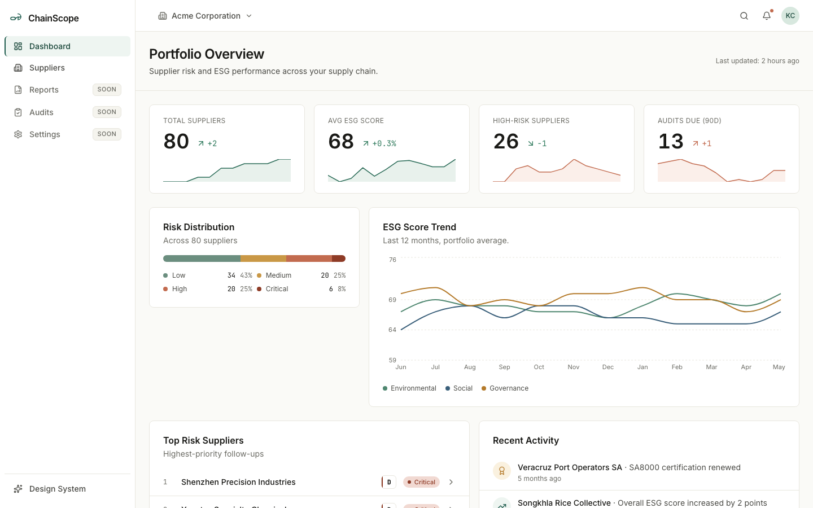
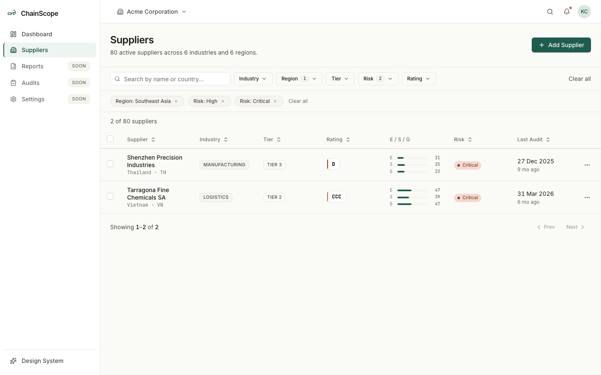
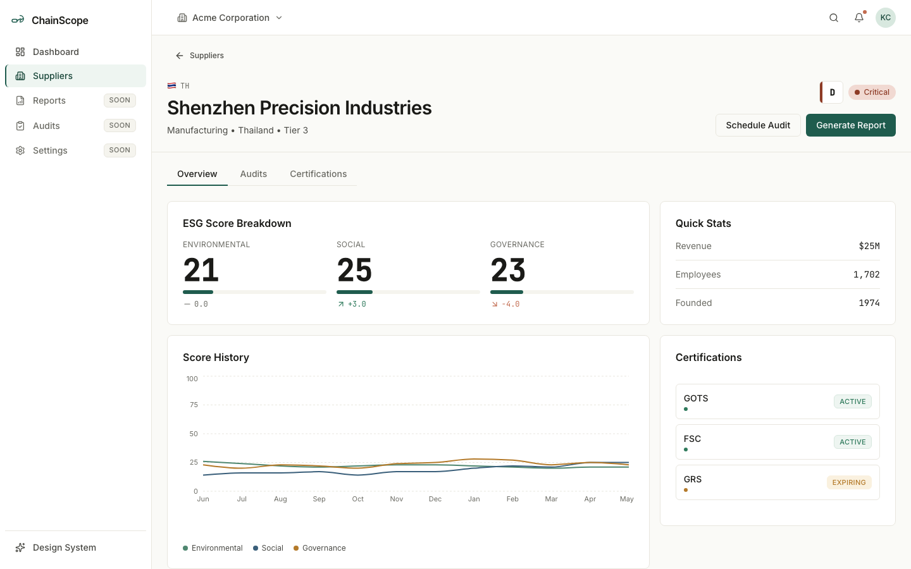

# ChainScope

Supply-chain ESG analytics UI. Portfolio demo with fictional data.

**Live:** https://chainscope.kevinciang.com | **Repo:** https://github.com/kevinciang1006/chainscope


*Dashboard: KPI cards, risk distribution, 12-month ESG trend, top risk suppliers and recent activity.*


*Suppliers list with two filters applied through URL params (`?reg=Southeast Asia&risk=High,Critical`).*


*Supplier detail: rating, E/S/G breakdown, audits and certifications.*

## What it does

- Dashboard with KPI cards, risk distribution, a 12-month ESG score trend, top risk suppliers and recent activity.
- Supplier list of 80 fictional suppliers with search, multi-select filters (industry, region, tier, risk, rating), sorting and pagination.
- Supplier detail page with ESG rating, score history, audit timeline and certifications.
- A design system reference page at `/design-system`.

## Frontend details

- Filters are synced to the URL, so any filtered view can be shared as a link.
- The mock API adds simulated latency, so TanStack Query loading and empty states are exercised for real.
- Sortable table headers set `aria-sort`. Controls are native buttons or Radix primitives with visible focus rings.
- Risk and status are always shown with text or an icon, never by colour alone.
- Numeric columns and KPIs use `tabular-nums`.
- Design tokens (colours, type) are defined with Tailwind v4 `@theme`.
- Number formatters and `CountUpNumber` take a `locale` argument. The default is `en-US` (`DEFAULT_LOCALE` in `src/lib/constants.ts`).

## Testing

Vitest runs 12 tests across three files:

- `src/lib/formatters.test.ts`: count, percent, score and delta formatting, including zero, large values and a `de-DE` locale.
- `src/lib/risk.test.ts`: grade to band mapping at the edge of each band.
- `src/hooks/useFilters.test.tsx`: parsing filters from the URL, ignoring invalid values, updating filters, and clearing them.

```bash
npm test
```

Accessibility is checked with axe-core through Playwright. Results as of 2026-10-05, run at 1440x900 against the production build:

| Page | Violations |
| --- | --- |
| Dashboard (`/`) | 1 (color-contrast, serious, 1 node) |
| Suppliers list (`/suppliers`) | 1 (color-contrast, serious, 7 nodes) |
| Supplier detail (`/suppliers/sup-001`) | 1 (color-contrast, serious, 2 nodes) |

All remaining violations are text in the risk colours (`risk-low`, `risk-medium`, `risk-high`, `warning`) on their tinted backgrounds, which fall below 4.5:1. They are not fixed yet. Automated checks do not cover everything, and supplier table rows open the detail page on click only.

To run the check:

```bash
npm run build
npx vite preview --port 4173   # in a second terminal
node scripts/a11y-check.mjs
```

`node scripts/screenshots.mjs` regenerates the images in `docs/screenshots/` the same way. Both scripts need Chromium (`npx playwright install chromium`).

## Stack

React 19, Vite, TypeScript (strict), Tailwind CSS v4, TanStack Query, TanStack Table, Recharts, Radix UI, React Router 7, Vitest.

## What this demo does not do

- No backend. Data is seeded fixtures in `src/data/fixtures/`, generated with a seeded PRNG so output is reproducible.
- No auth and no CRUD. Action buttons show toasts.
- Light mode only.
- No localisation. Number formatters accept a locale, but there is no translated UI and dates and relative times are English only.

## Run locally

```bash
npm install
npm run dev
```

## Project structure

```
src/
  app/           # router + providers
  pages/         # one folder per route
  components/
    ui/          # hand-written shadcn-style primitives (button, card, ...)
    common/      # domain-aware (RatingBadge, RiskPill, ...)
    layout/      # AppShell, Sidebar, Topbar
  data/
    fixtures/    # 80 suppliers, 30 activity events, seeded PRNG
    api/         # async functions wrapping fixtures with latency
  hooks/         # useFilters (URL-synced), useDebounce, useToast, TanStack Query wrappers
  lib/           # formatters, risk helpers, constants, cn util
  styles/        # Tailwind v4 @theme tokens
  test/          # Vitest setup
  types.ts       # all domain types
scripts/         # a11y-check.mjs, screenshots.mjs
docs/screenshots/
```

Originally built as a portfolio piece for a frontend application at ESGpedia.
